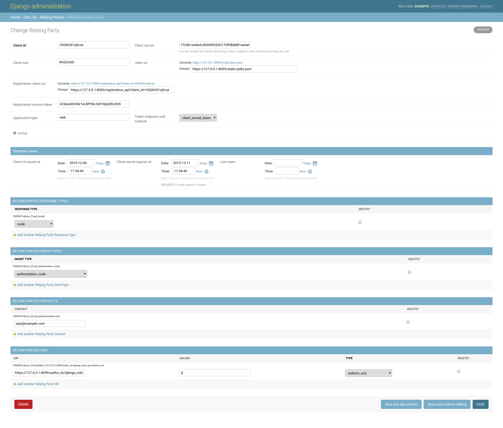

# django-oidc-op
A Django implementation of an **OIDC Provider** on top of [jwtconnect.io](https://jwtconnect.io/).
To configure a standard OIDC Provider you just have to edit the oidcendpoint configuration file.
See `example/example/oidc_op.conf.yaml` to get in.

This project is based on [Roland Hedberg's oidc-op](https://github.com/rohe/oidc-op), that support the following standards and drafts:

- [OpenID Connect Core 1.0 incorporating errata set 1](https://openid.net/specs/openid-connect-core-1_0.html)
- [OpenID Connect Session Management 1.0 - draft 28](https://openid.net/specs/openid-connect-session-1_0.html)
- [oAuth2 Token introspection](https://tools.ietf.org/html/rfc7662)

It also have a support, with the help of `add_on` modules, of the followings features:

- Custom scopes, that extends [OIDC standard ScopeClaims](https://openid.net/specs/openid-connect-core-1_0.html#ScopeClaims)
- PKCE, [Proof Key for Code Exchange by OAuth Public Clients](https://tools.ietf.org/html/rfc7636)

## Status
_Work in Progress_

- Relying-Parties Admin UI completed, unit tests included.
- Session management and cookies: still in progress.

Please wait for the first release tag before considering it ready to use.

## Run the example demo

````
git clone https://github.com/peppelinux/django-oidc-op.git
cd django-oidc-op

pip install -r requirements.txt

cd example
pip install -r requirements.txt
./manage.py migrate
./manage.py createsuperuser
./manage.py collectstatic

# debug server
gunicorn example.wsgi -b0.0.0.0:8000 --keyfile=./data/oidc_op/certs/key.pem --certfile=./data/oidc_op/certs/cert.pem --reload --log-level debug --timeout 3600 --capture-output --enable-stdio-inheritance
````

You can use [JWTConnect-Python-OidcRP](https://github.com/openid/JWTConnect-Python-OidcRP) as an example RP as follows:


`cd JWTConnect-Python-OidcRP
RP_LOGFILE_NAME="./flrp.django.log" python3 -m flask_rp.wsgi ../django-oidc-op/example/data/oidc_rp/conf.django.yaml`


## Configure OIDC endpoint

#### Django settings.py parameters

`OIDC_OP_AUTHN_SALT_SIZE`: Salt size in byte, default: 4 (Integer).

#### Signatures
These following files needed to be present in `data/oidc_op/private` otherwise they Will be created on the first time (see example).

1. session.json (JWK symmetric);
2. cookie_sign_jwk.json (JWK symmetric);
3. cookie_enc_jwk.json (JWK symmetric), optional, see `conf.yaml`.

To create them by hands comment out `'read_only': False'` in `conf.yaml`,
otherwise they will be created automatically on each run.

A JWK creation example would be:
````
jwkgen --kty SYM > data/oidc_op/private/cookie_enc_jwk.json
````

# Django custom implementations

This project rely interely on behaviour and features set provided by oidcendpoint but to get an exaustive integration in Django it
can adopt the following customizations.

#### UserInfo endpoint

Claims to be released are configured in `op.server_info.user_info` (in `conf.yaml`).
All the attributes release and user authentication mechanism rely on classes implemented in `oidc_op.users.py`.

Configuration Example:

````
    userinfo:
      class: oidc_op.users.UserInfo
      kwargs:
        # map claims to django user attributes here:
        claims_map:
            phone_number: telephone
            family_name: last_name
            given_name: first_name
            email: email
            verified_email: email
````

#### Relying-Party Registration

See oidc_op.models and admin, an UI was built to let us configure new RP via Django admin backend.



## OIDC endpoint url prefix
Can be configured in `urls.py` and also in oidc_op `conf.yaml`.

- /oidc/endpoint/<provider_name>


## Running tests

running tests
````
./manage.py test --pdb  oidc_op.tests.01_client_db
````

## code coverage
````
coverage erase
coverage run manage.py test
coverage report
````
