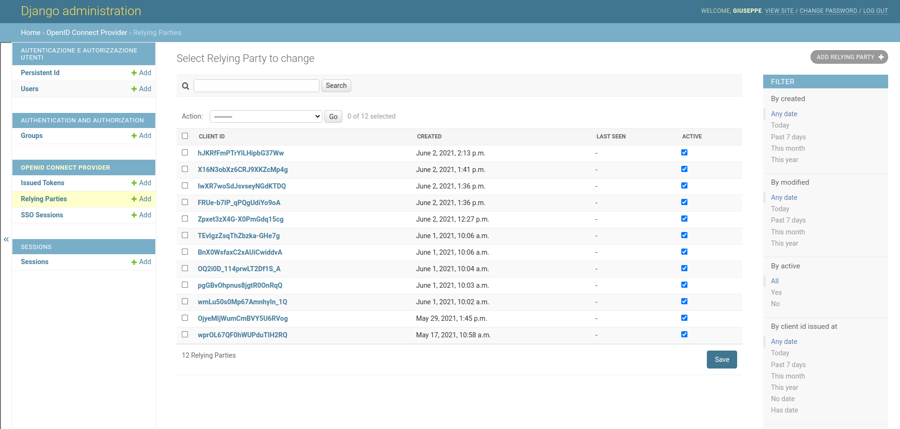
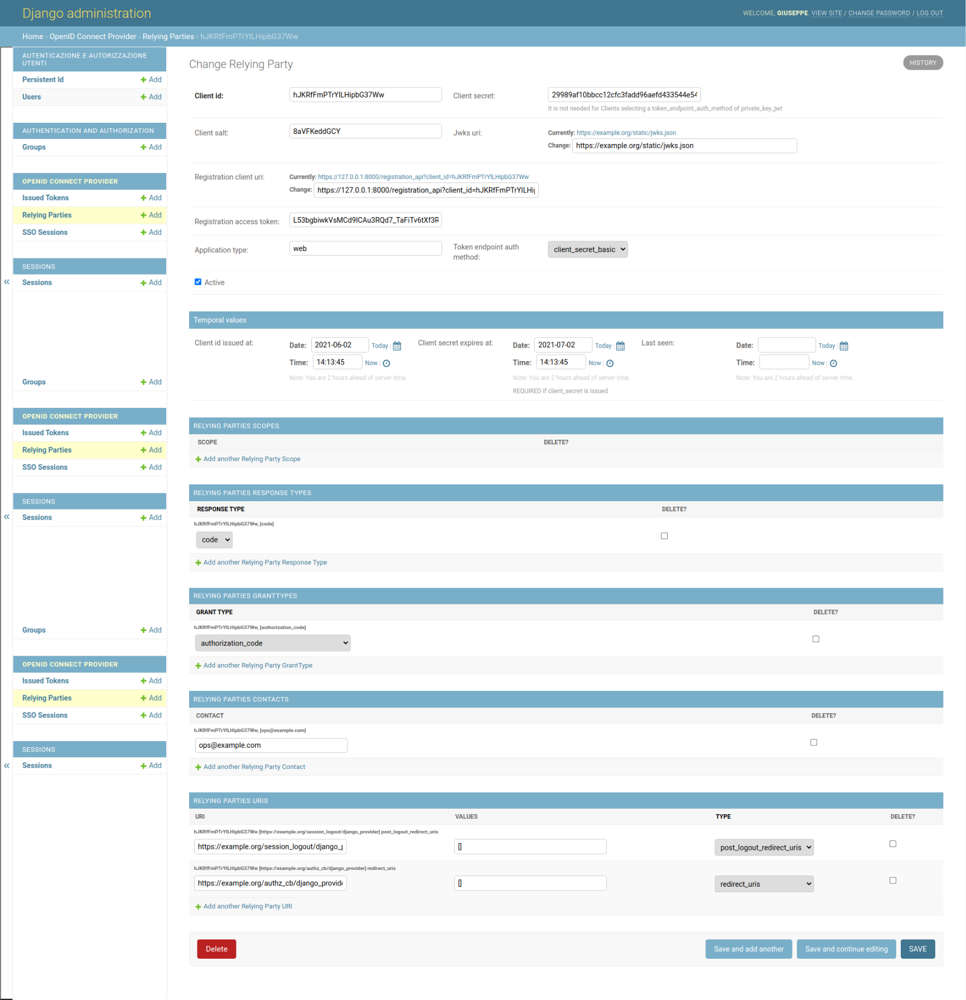
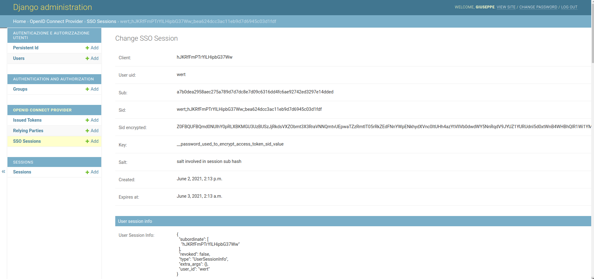
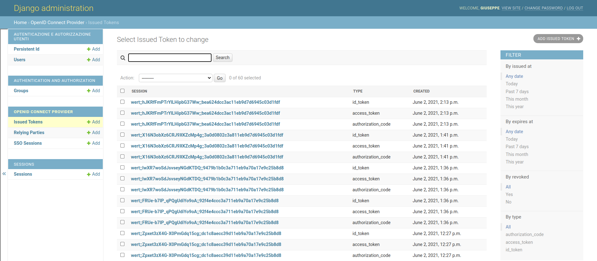
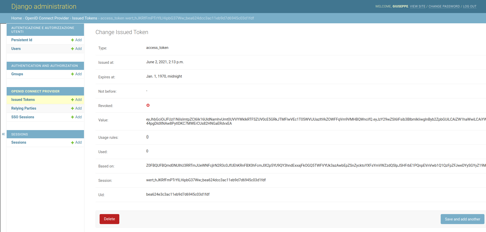

# django-oidc-op


A Django implementation of an **OIDC Provider**/**OAuth2 AS** on top of [jwtconnect.io](https://jwtconnect.io/).
This project is based on [IdentityPython oidc-op](https://github.com/IdentityPython/oidc-op).
Please consult the official [oidc-op documentation](https://oidcop.readthedocs.io/en/latest/) for any further information about its features and capabilities.

To configure a standard OIDC Provider you have to edit the oidcop configuration file.
See `django-oidc-op/oidc_provider/tests/example/example/settings.py` and `django-oidc-op/oidc_provider/tests/example/example/oidc_provider_settings.py` to get in.

## Run the example demo
````
git clone https://github.com/peppelinux/django-oidc-op.git
cd django-oidc-op

pip install -r requirements.txt
cd example

./manage.py createsuperuser

bash run.sh
````

#### Example Relying-Party

You can use [JWTConnect-Python-OidcRP](https://github.com/openid/JWTConnect-Python-OidcRP) as follow:
```
cd JWTConnect-Python-OidcRP
RP_LOGFILE_NAME="./flrp.django.log" python3 -m flask_rp.wsgi ../django-oidc-op/example/data/oidc_rp/conf.django.yaml
```

You can also use a scripted RP handler on top of oidc-rp
````
python3 snippets/rp_handler.py -c oidc_provider/tests/oidc_rp/conf.json -u test -p testami18 -iss django_provider
````

## Configuration

This project relyies interely on behaviour and features provided by oidcop, to get an exaustive integration in Django it
adopts the following customizations.

#### oidc_provider_settings.py

In the example project it handles all the oidcop configurations.
I think it's more cleaner but feel free to adapt in your preferred schema.

#### Settings

- `OIDCOP_CONFIG` is a python dictionary that contains the oidcop configuration.
- `OIDC_URL_PREFIX`, eg: `oidcop/` if present will be used as url path in all the oidcop endpoints, except for `.well-known/openid-configuration`. In the example project I put this parameter in `oidc_provider_settings`, default is `''`.


#### UserInfo endpoint

Claims to be released are configured in `op.server_info.user_info` (in `oidc_provider_settings.py`).
The attributes release and user authentication mechanism rely on classes implemented in `oidc_op/users.py`.

Configuration Example:

````
      "userinfo": {
        "class": "oidc_provider.users.UserInfo",
        "kwargs": {
            # map claims to django user attributes here:
            "claims_map": {
                "phone_number": "telephone",
                "family_name": "last_name",
                "given_name": "first_name",
                "email": "email",
                "verified_email": "email",
                "gender": "gender",
                "birthdate": "get_oidc_birthdate",
                "updated_at": "get_oidc_lastlogin"
            }
        }
      }
````

## Developers'

#### Running tests

running tests
````
./manage.py test oidc_provider
````

#### coverage
````
coverage erase
coverage run manage.py test oidc_provider
coverage report -m
````

## Author

- Giuseppe De Marco


## Gallery

#### Relying-Party



#### Session management and token preview



